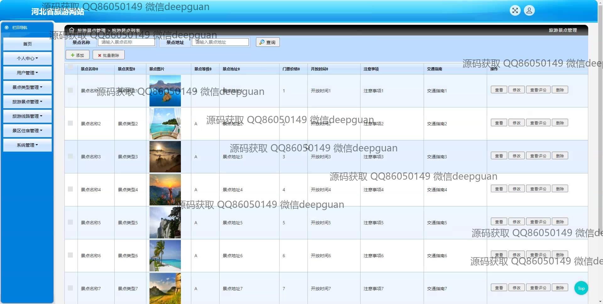
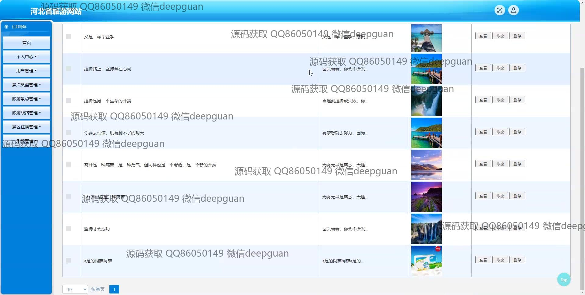
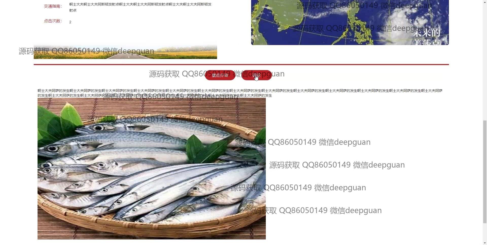

<h1 align="center">河北省旅游网站</h1>

## 简介
河北省旅游网站：提供旅游景点、旅游线路、景区住宿、旅游指南等信息；具备后台管理功能，包括用户管理、评论编辑、景点及住宿信息管理，支持在线咨询与轮播图管理，旨在提升用户体验与信息获取效率。    --计算机毕业设计源码；毕设源码；java毕业设计源码

## 联系方式

<h3 align="center">获取完整代码与数据库文件 + 微信：deepguan QQ: 86050149 QQ群: 783742310</h3>

<h3 align="center">可帮忙远程部署 包运行成功！提供远程部署、修改代码、设计文档指导、代码讲解等服务！</h3>

## 功能介绍（完整见运行截图）
管理员：  
基本功能：登录、注册、修改密码、退出  
网站首页：主导航栏、图片轮播图管理、景点及住宿推荐管理、旅游线路展示管理  
后台管理：景点管理（信息编辑、评论查看）、住宿管理（客房信息管理）、旅游线路管理（线路规划编辑）、用户管理、系统管理（安全设置）  
搜索功能：支持景点名称、住宿名称和线路查询，方便数据管理  

用户：  
基本功能：登录、注册、退出  
网站首页：主导航栏、图片轮播展示、旅游线路推荐、热门景点及住宿信息浏览  
旅游服务：景点搜索、旅游线路查询、景区住宿信息查看及评论互动  
个人中心：个人信息查看与修改、我的订单及收藏管理、在线咨询功能  

游客：  
网站首页：自然风光轮播展示、热门景点推荐、旅游指南浏览  
旅游规划：支持景点搜索、路线规划和住宿选择，查看详细信息  
在线咨询：提供即时留言功能，解答旅行相关疑问  

开发者：  
文件管理：资源文件整理及测试，包括图片、文档、音视频文件等  
功能测试：轮播图、搜索功能、交互界面验证，确保系统稳定性  
界面设计：结合自然风光主题，优化用户体验，增强旅游主题表现力

## 运行截图

本代码来源于网络,仅供学习参考使用!

